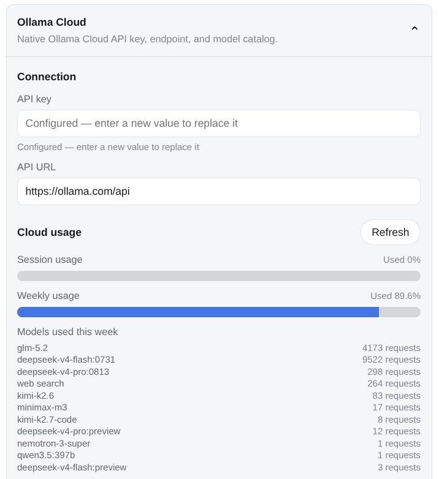
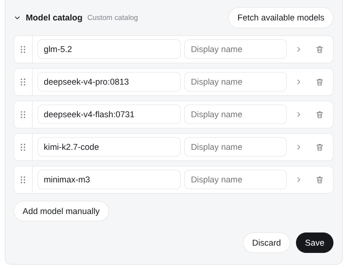

# dsh-llm-ollama

[English](README.md) | 中文

DeepSeek Harness 的 Ollama Cloud 集成。聊天通过共享的 pi-ai adapter 使用 Ollama 的 OpenAI-compatible Chat Completions；模型发现和 Web Search/Fetch 继续使用 Ollama 原生 API，因为这些独立能力不属于聊天协议。

包根入口公开 Cordis plugin contract 和 OllamaAdapter。同一 artifact 还导出 ./client，在 Settings → LLM Providers 中提供 Ollama Cloud 卡片。协议与能力分离决策记录在 [ADR 0001](docs/adr/0001-separate-chat-protocol-from-ollama-capabilities.zh.md)。

## 兼容性

可选的 DSH 宿主 peer 和开发依赖接受 `0.1.7-alpha.2` 及之后的发行版。Cordis peer 接受 `>=4.0.4 <5.0.0`。

`package.json#dsh.compatibility.dshReleases` 里的已验证宿主是证据，不是允许列表。未知的新宿主告警一次后仍按正常路径挂载。只有复现过的故障才会加入 blocklist。

`catalogId` 与未解析的 `unknown` 账户状态在运行时挂上。已发布的 `dsh-llm-providers-ui` 0.2.8 不含这些字段，并把 `unknown` 当成未连接；只有更新的 Owner 才会生效。

## 安装

已在官方 DeepSeek Harness `0.1.7-alpha.2` 和 `0.1.7-rc.1` 验证。直接从 GitHub 安装：

~~~sh
dsh plugin --profile web add --force \
  https://github.com/NOirBRight/dsh-llm-providers-ui/releases/download/v0.2.13/dsh-llm-providers-ui-0.2.13.tgz
dsh plugin --profile web add --force \
  https://github.com/NOirBRight/dsh-llm-ollama/releases/download/v0.6.27/dsh-llm-ollama-0.6.27.tgz
dsh web
~~~

仓库跟踪可直接发布的 lib artifacts，因此 GitHub 安装不需要 build-script allowlist。

## Connection 身份验证与信任

本插件通过官方 Alpha.4 Connection 服务的两参数 `rpc.handle(channel, handler)` API 注册设置、发现和用量 channel。不选择 authority；Alpha.4 Connection 对所有 Host RPC 方法和 WebSocket stream 统一执行已验证的浏览器会话策略。

每个进程都会生成随机启动 token。DSH 只在 `GET /` 上接受该 token，将其交换为绑定 authority 的签名浏览器会话 cookie，然后重定向到干净的根 URL。缺少、过期、格式错误或 authority 不匹配的 cookie 会在 RPC 分发前返回 401；静态资源仍可公开访问。根交换之外的 query token 和 Authorization header token 均不接受。

身份验证前，Connection 要求 Host 为 loopback，或匹配 Host 配置的 `--trusted-host` 条目。若请求带有 Origin，它必须等于 Host；跨站 Fetch Metadata 会被拒绝。Host/Origin 检查失败返回 403，可信但未认证的请求返回 401。远程浏览器应配置 Host allowlist 并使用 DSH 打印的 authenticated URL，也可以使用 SSH loopback tunnel。本插件不会绕过 Host 信任或浏览器会话检查。

## Web 配置

打开 Settings → LLM Providers → Ollama Cloud。卡片通过已验证的 Connection RPC 管理设置和凭据。Host 不会返回已保存的明文；设置的 revision 防护不会把凭据存储和设置保存伪装成一个原子事务。

Fetch available models 会立即打开 picker，并通过已验证的 Connection RPC 发送未保存 endpoint 和一次性 key。Host 读取 /api/tags、按原生 id 去重，并最多并发六个 /api/show 请求 enrich 模型。原生元数据会提供 /v1/models 不提供的 context window 及 vision、thinking、tools 标志。Picker 从当前草稿选择初始化，保留 current-only 模型，并在应用时替换草稿目录。

卡片的「云端用量」区与 ollama.com/settings 一致：Host 用已存（或一次性）key 读取 GET <baseURL>/usage，把端点报告的各个窗口（每月 / Session / 每周）渲染成已用百分比进度条，并列出该窗口各模型的请求数。凭据不会传到浏览器。没有用量接口的自建端点会显示「不支持」提示而不是报错。

模型目录默认折叠，展开后一行一个模型：左侧把手可拖动排序（顺序随目录一起保存），右侧箭头展开该行的上下文窗口、最大输出和能力开关，垃圾桶按钮删除该行。

### 插件配置截图

云端各窗口用量，以及该窗口的模型活动列表：

可拖动排序的模型目录：

Models 页面会列出已保存的 ollama-cloud 模型并允许选择。当前 Harness 版本没有 Models 页面里的第三方编辑器 slot，因此本包在 Plugin configuration 中持有完整编辑器。

## 能力与协议分离

聊天使用：

    POST <openai-base>/chat/completions

配置中的 baseURL 仍表示 Ollama 原生 API 地址。插件会把聊天映射到相邻的 /v1：

    https://ollama.com/api  ->  https://ollama.com/v1
    http://localhost:11434/api  ->  http://localhost:11434/v1

Ollama 原生独立能力继续使用：

    模型发现  ->  GET /api/tags + POST /api/show
    网页搜索  ->  POST /api/web_search
    网页抓取  ->  POST /api/web_fetch

Search 和 Fetch 是 ctx.web provider，因此可与任意聊天模型配合。只要 profile 选择 ollama-cloud，DeepSeek、Codex、Kimi 或 OpenAI-compatible 聊天模型都可以调用 Ollama 提供的 web_search 工具。

不把 OpenAI Responses 设为默认，因为 Ollama 只支持 non-stateful 版本。不把 Anthropic Messages 设为默认，因为 Ollama Cloud 需要额外 Bearer header，而且该兼容面没有模型列表或 prompt caching。

## Web 搜索与抓取

Host plugin 会把两个 Web provider 注册为 ollama-cloud。注册本身不会改变部署策略；在 profile patch 中 pin 需要的 provider：

~~~yaml
- id: web
  config:
    searchProvider: ollama-cloud
    fetchProvider: ollama-cloud
~~~

省略 fetchProvider 可继续使用内置 HTTP fetcher，只把搜索切到 Ollama。两个 provider 都会在跟随 redirect 前拒绝。每次尝试默认有 15 秒预算，一次瞬时超时或收到 HTTP 响应前的传输失败会重试；HTTP 错误、格式错误响应、缺失凭据、redirect 和调用方取消不会重试。

## 配置

~~~yaml
- id: llm-ollama
  name: 'dsh-llm-ollama'
  config:
    apiKeyEnv: OLLAMA_API_KEY
    baseURL: https://ollama.com/api
    maxTokens: 4096
    defaultContextWindow: 262144
    streamIdleTimeoutMs: 300000
    webRequestTimeoutMs: 15000
    retryPolicy:
      mode: normal
      maxRetries: 8
      backoff:
        initialDelayMs: 500
        maxDelayMs: 10000
        jitterRatio: 0.1
    models:
      - id: gpt-oss:20b
        name: GPT-OSS 20B
        contextWindow: 131072
        thinking: true
      - id: llava
        name: LLaVA
        contextWindow: 4096
        vision: true
~~~

bundle 默认对符合条件的模型请求失败最多重试八次。官方无状态码的生成、可达性和过载失败归类为 `SERVER`；鉴权、无效请求和不支持内容失败仍不可重试。

Provider route 继续是 ollama-cloud，设置命名空间继续是 llm-ollama。只有配置目录中的模型可以聊天。模型 entry 的 maxTokens 优先于 route 值；两者都不存在时，adapter 不设置请求默认。Ollama 不公开逐模型输出限制，因此发现结果不会填写 maxTokens。

选择器 id 可以用通用上下文后缀 `-<n>k` 或 `-<n>m`（例如 `qwen3-272k` 或 `qwen3-1m`）。插件在发给 Ollama 前剥掉该后缀；行上没有显式 `contextWindow` 时，用 `n×1000` / `n×1,000,000` 作为 DSH 压缩预算。`kimi-k3-max` 这类产品名不算档位。Composer picker 按剥后缀后的 base 把兄弟行收成一个家族。`-fast` 会当成 Fast 兄弟用于分组；Ollama Cloud 没有 Fast API 字段，所以 wire id 仍是剥完后的 base。

Fallback context window 是 262,144 tokens。正常情况下发现过程应提供精确模型值；元数据缺失时，该 fallback 也为 pi-ai 的上下文安全余量留出空间。

### 模型能力

vision 决定 text/image 输入模态。thinking 启用可选择的 reasoning effort。已知的 Ollama Cloud 家族只暴露厂商真实档，并在会话未选择时使用插件 `defaultEffort`（GLM-5.2 和 Kimi K3 默认 max；DeepSeek V4 和 MiniMax M3 默认 high；GPT-OSS 默认 medium；Nemotron Super/Nano 默认 low）。未知 thinking model 仍提供 off、low、medium、high、max，且不设插件默认。tools 记录发现元数据；实际请求会携带当前 DSH tool definitions。

Ollama 的 OpenAI Chat Completions profile 被显式固定：发送 max_tokens、reasoning_effort 和 streaming usage，保留 system role，不发送 store、max_completion_tokens 或 prompt_cache 字段。

## 模型体验

### Prompt 影响

System prompt 和所有 provider-neutral 消息由 PiAiAdapter 转换成 OpenAI Chat Completions messages。工具调用保留 provider 签发的 id，工具结果用匹配的 tool_call_id 返回。只有标记 vision-capable 的模型会接收 base64 data URL 图片。

### Token 影响

Usage 映射成 Harness input/output 计数。pi-ai 会按配置的 context capacity clamp maxTokens 并保留安全余量。Ollama 当前不会通过该 endpoint 提供 cache-read/cache-write 统计。

### KV Cache 影响

模型、system prompt、历史、tool definitions 和请求选项不变时，序列化前缀保持稳定。Tool-call id 是 provider 签发的协议字段，回放时保持不变。修改更早消息、工具、图片、模型 id 或 reasoning/output 选项可能使 provider 侧复用失效。

## 已知限制与延后工作

- 共享 PiAiAdapter 不支持 GenerateOptions.stop。
- 不在保存目录中的模型会被拒绝；旧原生 adapter 的 pass-through 行为被移除。
- /api/show 会报告 thinking 能力，但不会报告精确 effort 集合，因此插件应用 Ollama 通用规则和 GPT-OSS 例外。
- Ollama 不公开逐模型输出限制。
- v0.2.2 及更早版本的日志可能包含重复 ollama-call-0；本次不迁移旧日志。
- 本包不公开 structured-output format 配置。

## LLM Providers UI ownership

**LLM 供应商**设置页（`settings.section` `id: providers` 及子槽 `settings.provider.item`）与共享的 `llm-providers` 排序存储完全由 `dsh-llm-providers-ui` 拥有。

- 本插件仅贡献自己的卡片（`key: llm-ollama`）和 Host 上的 `llm` 路由；不安装页面或共享命名空间。加载顺序不影响归属。
- 未安装 owner 时（Headless 或 Web 未装 `dsh-llm-providers-ui`）：Host 侧模型路由 `ollama-cloud` 仍可工作；Web 侧 Providers 页面与本卡片不显示，并在浏览器控制台提示缺少 owner。正式 Web 发版的组合测试会拒绝缺少 owner 的图。
- 导航地球图标为 Alpha.4 临时 DOM 适配器，仅由 `dsh-llm-providers-ui` 持有；本插件不含该适配。

请在 profile 中与 provider 插件一起显式安装 `dsh-llm-providers-ui`（见其 `cordis.patch.yml`）。

## 正式版安装（Latest）

Ollama Cloud chat, model discovery, and Web Search/Fetch providers. 正式成品面向官方 DeepSeek Harness `0.1.7-rc.1`；发布包只包含构建后的 Host/Client 产物，不包含兄弟仓库源码、本机路径或 link:/workspace: 依赖。

LLM Providers 页面、导航和共享排序由 dsh-llm-providers-ui 独占；本插件只提供卡片、模型和 Host 路由。Web 必须先装 Owner，headless 只使用 Host 路由时可以不装 Owner。

Latest（Owner + 本插件；Web 必须一起装）：

~~~sh
dsh plugin --profile web add --force \
  https://github.com/NOirBRight/dsh-llm-providers-ui/releases/latest/download/dsh-llm-providers-ui-0.2.13.tgz
dsh plugin --profile web add --force \
  https://github.com/NOirBRight/dsh-llm-ollama/releases/latest/download/dsh-llm-ollama-0.6.27.tgz
~~~

固定版本（可复现）：

~~~sh
dsh plugin --profile web add --force \
  https://github.com/NOirBRight/dsh-llm-providers-ui/releases/download/v0.2.13/dsh-llm-providers-ui-0.2.13.tgz
dsh plugin --profile web add --force \
  https://github.com/NOirBRight/dsh-llm-ollama/releases/download/v0.6.27/dsh-llm-ollama-0.6.27.tgz
~~~

更新、卸载与验证：

~~~sh
# 更新 Owner + 本插件到 Latest
dsh plugin --profile web add --force \
  https://github.com/NOirBRight/dsh-llm-providers-ui/releases/latest/download/dsh-llm-providers-ui-0.2.13.tgz
dsh plugin --profile web add --force \
  https://github.com/NOirBRight/dsh-llm-ollama/releases/latest/download/dsh-llm-ollama-0.6.27.tgz
# 验证加载与版本
dsh plugin --profile web list
dsh plugin --profile web doctor
# 只卸载本插件
dsh plugin --profile web remove dsh-llm-ollama
~~~

配置入口：Web 使用「设置」中的本插件页面；Host-only 插件使用 profile 的 dsh.profile.bundles 配置。先复制本 README 的最小 YAML/JSON 示例，再填写凭据或后端地址。

回滚：重新执行固定版本 v0.6.27 命令，确认插件列表后只重启一次 Web 服务。失败时查看 journalctl --user -u dsh-web.service 与 dsh plugin --profile web doctor，不要把源码 checkout 写入 production profile。

Release 与完整性：[v0.6.27](https://github.com/NOirBRight/dsh-llm-ollama/releases/tag/v0.6.27) · [SHA256SUMS](https://github.com/NOirBRight/dsh-llm-ollama/releases/download/v0.6.27/SHA256SUMS)。
